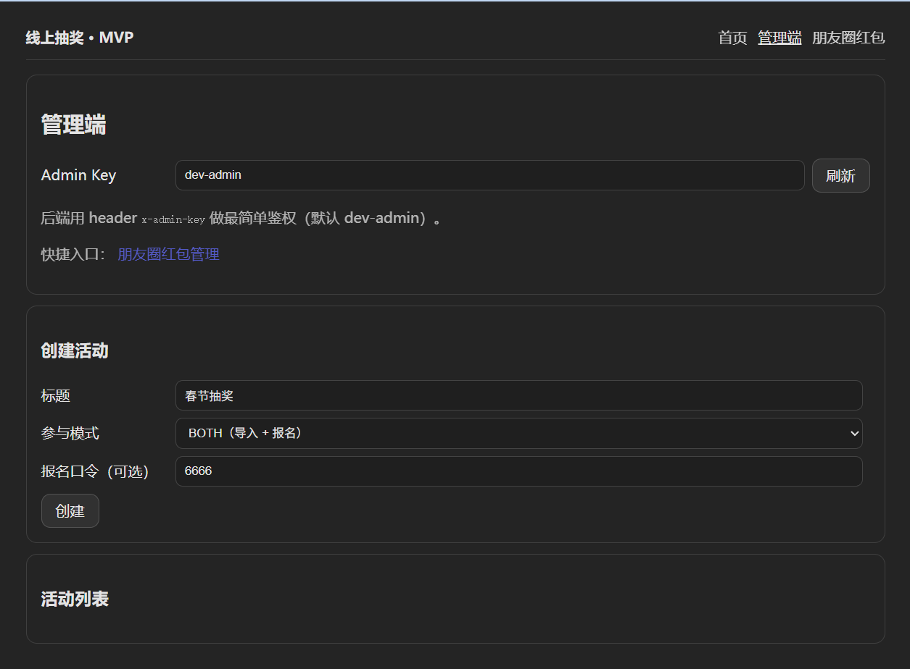
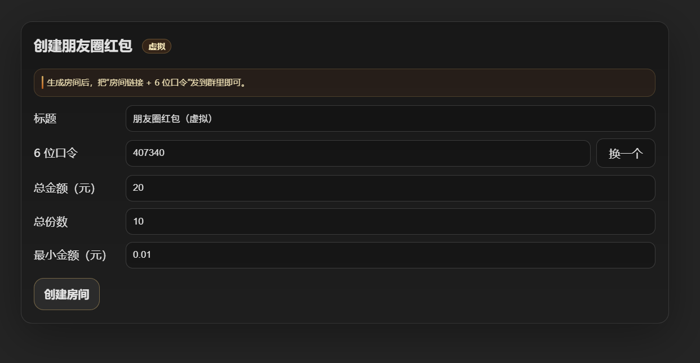
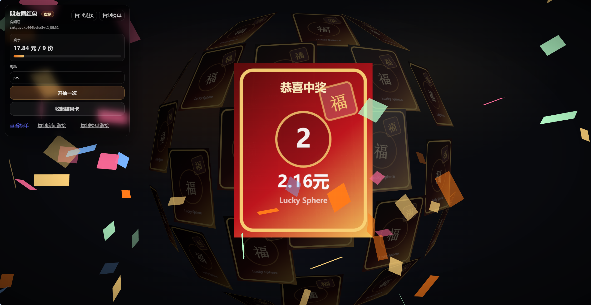
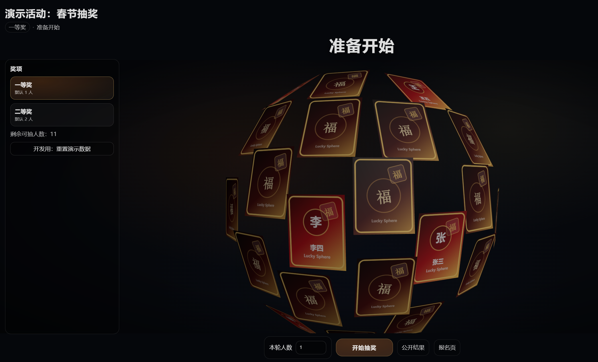

# lucky-sphere-lottery

春节/年会抽奖 + 朋友圈红包（虚拟）的 **Vue3 + Fastify + Prisma** 全栈项目，带 3D “Lucky Sphere” 开奖舞台。

适合春节/年会/群活动的线上抽奖骨架：**导入名单（IMPORT）** + **开放报名（SIGNUP）** 两种参与者来源可共存，并提供可配置的结果可见性（公开 / 仅管理员可见）。

## 截图

把截图放到 `docs/screenshots/`（见 `docs/screenshots/README.md` 的命名建议）。







## 技术栈

- **包管理**：pnpm（workspace 单仓）
- **前端**：Vue 3 + Vite + TypeScript + Vue Router
- **后端**：Fastify + TypeScript
- **数据库**：SQLite + Prisma

## 功能

- **年会抽奖（管理端）**
  - 新建活动 / 导入名单 / 新增奖项 / 抽奖（不允许重复中奖）
  - 奖项编辑、名单禁用/删除、一键重置中奖
  - 结果页可设置：公开 / 仅管理员可见（`x-admin-key`）
- **朋友圈红包（虚拟）**
  - 6 位口令入房间
  - 开抽动效（3D 球加速 + 开奖卡 + 彩纸爆炸）
  - 榜单页（需口令）

## 本地启动

在根目录：

```bash
pnpm install
pnpm dev
```

- Web：`http://localhost:5173`
- API：`http://localhost:3001`

## 最快体验流程（3 分钟跑通）

1. 打开管理端：`http://localhost:5173/admin`
2. **Admin Key**：默认是 `dev-admin`（浏览器会存到 localStorage 并在请求头带 `x-admin-key`）
3. 创建活动后，进入活动管理页：
   - 新增奖项（拿到 prizeId）
   - 导入名单（每行一个昵称）
4. 打开报名页：`/events/:eventId/signup`（可让别人自助加入）
5. 执行抽奖：管理页填 prizeId，点击“抽！”
6. 打开公开结果页：`/events/:eventId/results`

### 朋友圈红包（最快传播）

1. 打开创建页：`http://localhost:5173/rooms/new`
2. 创建成功后，把 **参与页链接 + 6 位口令** 发到群里
3. 榜单页：`/rooms/:roomId/board`（同样需要口令）

## 规则说明

- **不允许重复中奖**：数据库层面约束（同一 event 下 participant 只能有一条中奖记录）。
- **可复现随机**：每次抽奖都有 seed（可手动填，也可后端生成）；同 seed + 参与者集合会得到确定结果。

## 开源与免责声明

本项目为演示/学习用途，真实公司抽奖建议补充：更强鉴权、审计日志、稳定部署与数据备份。


